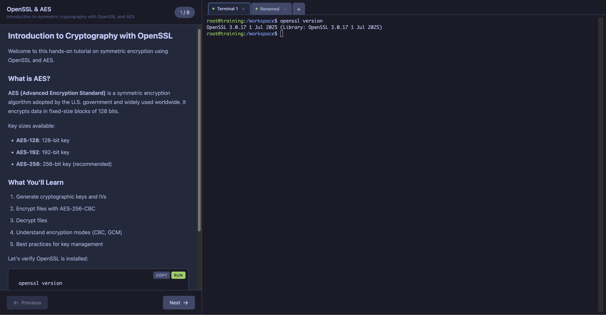

# Learning UI

Interactive learning environment with step-by-step instructions and web terminal. A self-hosted alternative to KillerKoda/Katacoda for hands-on tutorials.



## Features

- Split-pane interface with markdown instructions and web terminal
- Multiple terminal tabs (same container, independent shells)
- Step-by-step progression with optional validation checks
- Copy/Run buttons on code blocks for quick execution
- Syntax highlighting for code examples
- Resizable panels
- Persistent workspace storage
- Customizable shell container per scenario
- **Optional IDE**: Integrated code-server (VS Code in browser)
- **Optional K3S**: Embedded Kubernetes cluster for K8s tutorials
- **Custom Tabs**: Add any additional services (Jupyter, Grafana, etc.)

## Quick Start

### Install with Helm

```bash
# Basic installation
helm install my-learning ./chart

# With code editor enabled
helm install my-learning ./chart --set editor.enabled=true

# With embedded K3S cluster (for Kubernetes tutorials)
helm install my-learning ./chart -f chart/kubernetes01.values.yaml

# Git basics tutorial
helm install my-learning ./chart -f chart/git.values.yaml

# OpenSSL/AES cryptography tutorial
helm install my-learning ./chart -f chart/openssl.values.yaml
```

### Access the UI

```bash
# Port-forward if no ingress
kubectl port-forward svc/my-learning-learning-ui 8080:8080

# Open http://localhost:8080
```

## Documentation

Full documentation is available at: https://aydev-fr.github.io/learning-ui/

- [Getting Started](https://aydev-fr.github.io/learning-ui/docs/intro)
- [Writing Scenarios](https://aydev-fr.github.io/learning-ui/docs/scenarios)
- [Terminal Feature](https://aydev-fr.github.io/learning-ui/docs/features/terminal)
- [Kubernetes Environment](https://aydev-fr.github.io/learning-ui/docs/features/kubernetes)
- [VS Code Editor](https://aydev-fr.github.io/learning-ui/docs/features/editor)
- [Custom Tabs](https://aydev-fr.github.io/learning-ui/docs/features/custom-tabs)
- [Complex Scenarios](https://aydev-fr.github.io/learning-ui/docs/advanced/complex-scenarios)

## Project Structure

```
learning-ui/
├── .github/workflows/    # GitHub Actions for container builds
├── chart/                # Helm chart
│   ├── Chart.yaml
│   ├── templates/
│   ├── values.yaml          # Linux Shell Basics (default)
│   ├── kubernetes01.values.yaml
│   ├── git.values.yaml
│   └── openssl.values.yaml
├── docs/                 # Docusaurus documentation
├── web/                  # Frontend (HTML/CSS/JS)
├── main.go               # Go server
├── go.mod
├── Containerfile.ui      # Learning UI container
├── Containerfile.kubernetes  # Kubernetes shell container
├── Containerfile.scenario    # Generic shell container
└── LICENSE
```

## Container Images

Pre-built container images are available on GitHub Container Registry:

```bash
# Learning UI (web server)
ghcr.io/aydev-fr/learning-ui:latest

# Kubernetes shell (kubectl, helm, k9s)
ghcr.io/aydev-fr/learning-kubernetes:latest

# Generic shell (basic tools)
ghcr.io/aydev-fr/learning-shell:latest
```

## Development

### Building Container Images

```bash
# Build UI image
docker build -f Containerfile.ui -t learning-ui:latest .

# Build Kubernetes shell image
docker build -f Containerfile.kubernetes -t learning-kubernetes:latest .
```

### Local Testing with Kind

```bash
# Load images into Kind
kind load docker-image learning-ui:latest --name my-cluster
kind load docker-image learning-kubernetes:latest --name my-cluster

# Install chart
helm install test ./chart -f chart/values-kubernetes.yaml --set ingressHost=test.localhost

# Port-forward
kubectl port-forward svc/test-learning-ui 8080:8080
```

### Building Documentation

```bash
cd docs
npm install
npm run start  # Development server
npm run build  # Production build
```

## License

MIT License - see [LICENSE](LICENSE)
